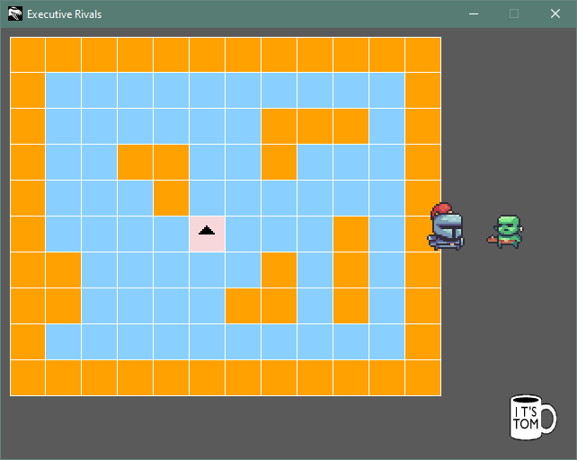

# Executive Rivals
This is an open-source dungeon crawler with corporate ambitions. It uses CMake and SDL. The generated executables
have icons.



## Platforms
* Windows
* Mac OSX
* Linux

## Building

Clone this repository.

```
git clone https://github.com/tomconder/rivals.git
```

[Install vcpkg](https://github.com/microsoft/vcpkg#getting-started), a dependency and package manager for C++.

Set `VCPKG_ROOT` to the location where you installed vcpkg

```
export VCPKG_ROOT <path to vcpkg>
```

[Install CMake](https://cmake.org/install/), a cross-platform build system.

Now you can use a preset to compile `maze`. Possible values
are: `x64-debug`, `x64-release`, `osx-debug`, `osx-release`, `linux-debug`, `linux-release`

```
cmake -DCMAKE_BUILD_TYPE=Release --preset x64-release
cmake --build out/build/x64-release --target game --config Release
```

Or, for Linux

```
cmake --preset linux-release
cmake --build --preset build-linux
```

The maze executable will be found in the build directory: `out\build\x64-release\maze\Release\maze.exe`

## Credits
Art assets from [Dagon's Dungeon Pack](https://im-dagon.itch.io/dungeon-pack)
